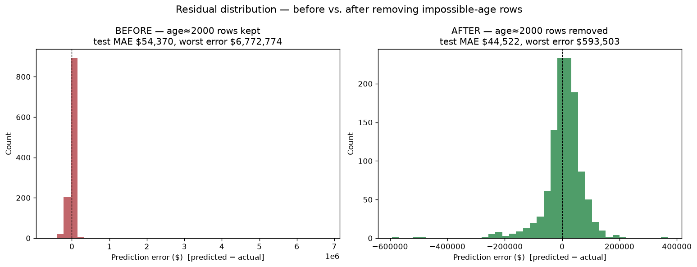

# Sprint 2 Reflection — NC Housing Price Prediction

_Companion to `charter.md` and `Sprint 1 Reflection.md`. Cohort: Tabular.
Focus: the change made since Check-In 1 and whether it worked._

> Drafted from my own session notes (`project/nc_housing_notes_v2.md`) plus
> the before/after run logs (`project/output_07_13.txt` → `output_07_15.txt`).
> These are graded — review, edit, and make them my own before submitting.

## What did you change since Check-In 1?

I removed the bad `housing_median_age` outlier rows — the ones listing a
block's median house age as roughly **2,000 years**, which is a physically
impossible data-entry error, not a real age. I found these while
investigating the residual plot (see `nc_housing_notes_v2.md`): the error
chart was lopsided, with most errors bunched near zero but a long tail
stretching far to the right from a handful of wildly wrong predictions.

Importantly, this is a *different* fix from the `housing_median_age == 2018`
filter that was already in the script — that filter never caught the
`== 2000` rows, so they survived into training and the test set. The cleaned
"ready" dataset now has **zero rows with age == 2000** (max age is a sensible
78). Training stayed at 50 epochs; nothing else about the model changed.

## Why did you think that change would help?

Those impossible-age rows were feeding garbage into training, and whenever
one landed in the test set the model produced an absurd prediction. The
residual plot's long right tail was the visible symptom. Removing confirmed
bad data should shrink that tail and cut the worst-case errors — without
touching the *legitimate* unusual homes (e.g. the genuinely expensive
Charlotte-area property), which are a real modeling challenge, not dirty data.

## Did it actually help? How do you know?

Yes — clearly on the worst-case behavior, with mixed effect on the average.

| Metric | Before (07-13, age≈2000 still in) | After (07-15, removed) |
| --- | --- | --- |
| Worst test predictions | **$6.8M and $7.0M** predicted vs. **$380K / $297K** actual (errors > +$6.4M) — these were exactly the age-2000 rows | Legitimate high-value Charlotte homes; no impossible outputs |
| Test MAE | $53,289 (0.533 scaled) | **$43,466 (0.435 scaled) — ~$9,800 / ~18% lower** |
| K-fold validation MAE | $41,390 (0.414 scaled) | $41,407 (0.414 scaled) — essentially flat |

**How I know:** I compared the two run logs directly. Before the fix, the
three worst residuals included runaway predictions of ~$6.8M and ~$7.0M
against actuals under $400K — and those rows were precisely the ones with
`housing_median_age == 2000`. After removing them, those runaway predictions
are gone entirely; the worst residuals are now real, unusually expensive
homes. Test MAE fell about 18%, and the k-fold results stayed consistent
across folds, so the setup itself remained stable.

### Controlled before/after (isolating just the age rows)

To make sure the win is attributable to *this one change* and not to anything
else that differed between sessions, I ran a controlled A/B
(`project/before_after_residuals.py`): same source file, same feature columns,
same split seed, same architecture, same 50 epochs, same weight-init seed —
toggling **only** whether the two `age == 2000` rows are present.

| Metric | BEFORE (age≈2000 kept) | AFTER (age≈2000 removed) |
| --- | --- | --- |
| Test MAE | $54,370 | **$44,522 (~18% lower)** |
| Worst single error | **$6,772,774** | $593,503 |
| Rows | 5,637 | 5,635 |

The picture below tells the story at a glance: with the bad rows in, the
residual distribution has a long tail dragging all the way out past **$6.7M**
(the classic symptom from the residual investigation); with them removed, the
distribution collapses to a tight band roughly ±$200K around zero.

**Honest caveat:** the k-fold *validation* MAE barely moved between the
original sessions ($41,390 → $41,407), so the fold average was never what the
bad rows were hurting — the damage was concentrated in a few catastrophic
test predictions, which is exactly what got fixed. So the clearest,
directly-attributable win is the elimination of the impossible
multi-million-dollar outputs and the ~18% test-MAE drop, rather than a large
move in the average validation metric.

**Supporting artifacts:**
- Controlled before/after residuals — `project/nc_housing_residuals_before_after.png`
- Single (after) residual distribution — `project/nc_housing_residuals.png`
